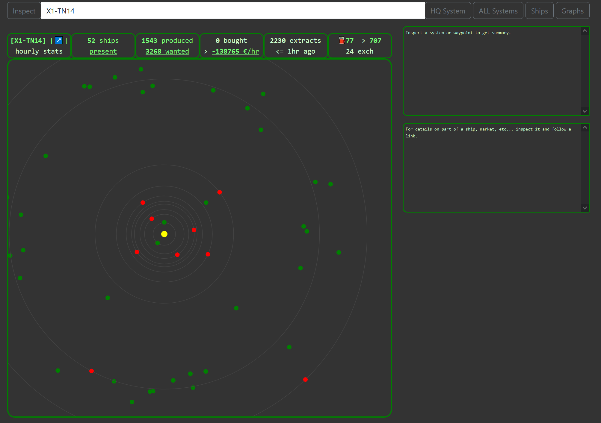
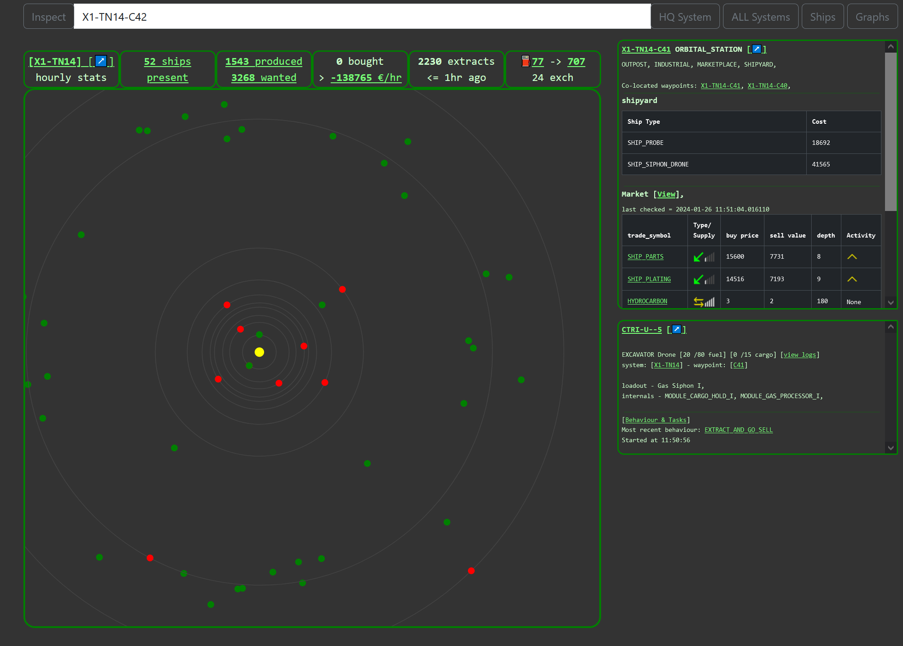
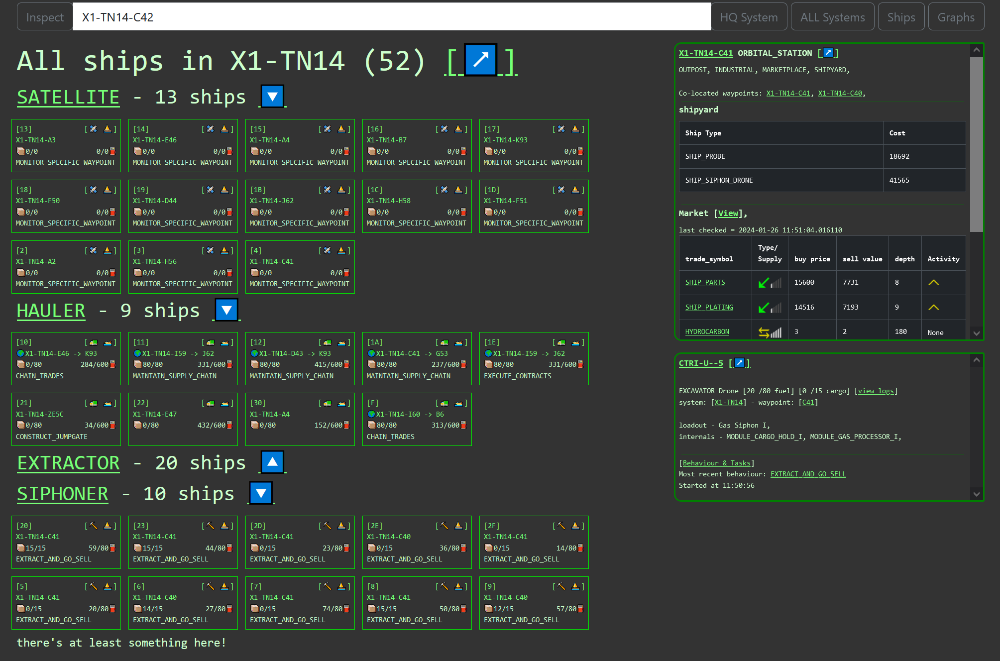
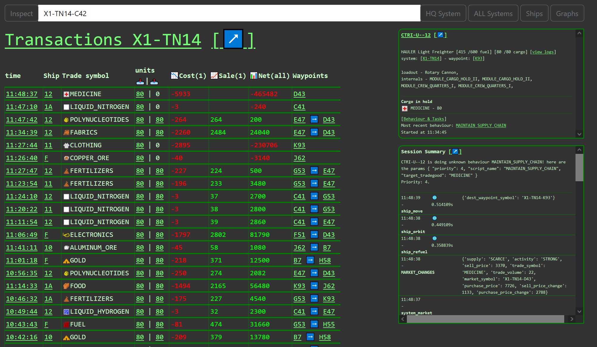
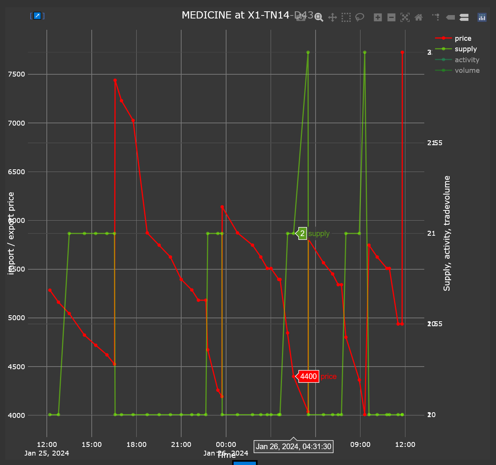

# Executive Summary

a GUI front end for my [spacetraders.io](https://www.spacetraders.io/) implimentation.

SpaceTraders is a programming exercise / MMO game where players use a public REST API to control a fleet of ships to travel around a galaxy, buy and sell goods, explore, and complete generated contracts. 

Note. that this project is not yet complete and an instructional overhaul for ease of usability is still planned. 

- [Overview](#Overview)
- [Environment setup](#Setup)
- [Deployment](#Deploy)

# Overview

This UI is predominantly for monitoring the status of a player's fleet, as well as surfacing information from the various waypoints (such as planets, asteroids, space stations etc...) you can visit in game.

By sharing a common database with my back end client (see [spacetraders]() repo) it is able to display information in a more helpful and meaningful way than the raw JSON data returned by the API, or just rows in a database.

## Features

- Visually display a system of waypoints 
  

- Click to display more information without leaving the page
  

- inspect all ships in your fleet (or in a given system)
  

- View the trading history of your ships
  

- and view historic changes in given goods in a visually meaningful medium
  

## Setup
The easiest way to run this is using the container here [ctriatanitan/spacetraders_ui](https://hub.docker.com/repository/docker/ctriatanitan/spacetraders_ui/general).

In order for it to run you will need a functioning spacetraders_db  (available here: [ctriatanitan/spacetraders_db](https://hub.docker.com/repository/docker/ctriatanitan/spacetraders_db/general)) . Make sure this is running on the same docker_network, or supply connection credentials to the ui container.

If you wish to run it locally outside of the container, you will also need the spacetraders_sdk installed. 
That can be found here: https://github.com/Ctri-The-Third/spacetraders_sdk

## Deployment
The easiest way to run this is using the container available here [ctriatanitan/spacetraders_ui](https://hub.docker.com/repository/docker/ctriatanitan/spacetraders_ui/general)

However, if you want to run it locally, you can do so by following these steps:

* install python 3.9+
* Clone the repository
* install the requirements.txt file
* run main.py
* connect to localhost:3000
